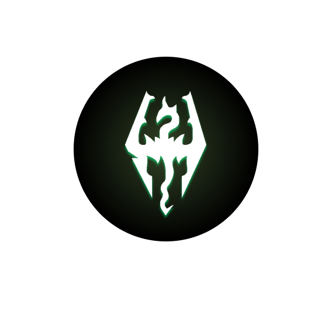
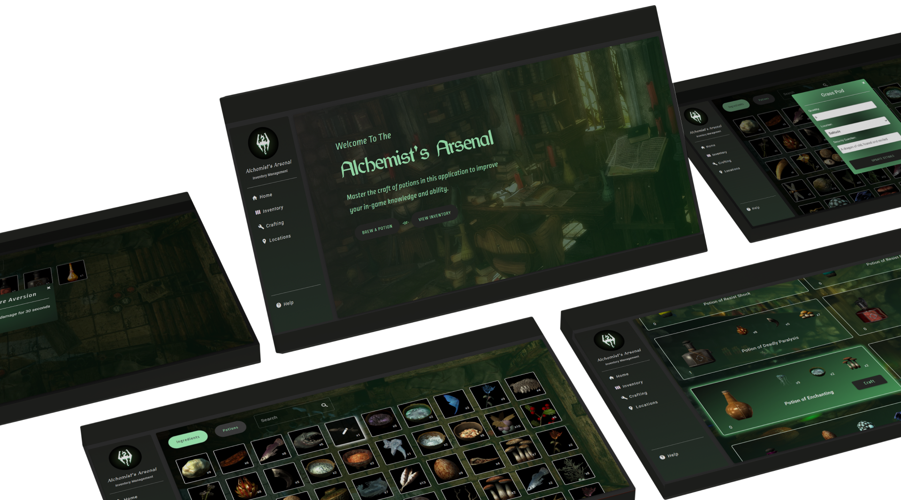
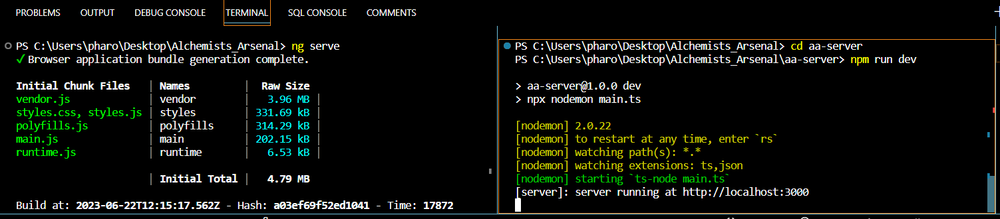

<br />


[![Instagram][instagram-shield]](https://www.instagram.com/kay_pharoah/)

<!-- HEADER SECTION -->
<h5 align="" style="padding:0;margin:0;">Kyle Pharoah</h5>
<h5 align="" style="padding:0;margin:0;">200277</h5>
<h6 align="">Interactive Development 300</h6>
</br>
<p align="">

  <div align="center">
  <a href="https://github.com/xviovx/Alchemists_Arsenal">
      
  </a>
</div>

  
  <!-- <h3 align="center">Project Name</h3> -->

  <p align="center">
    A Skyrim ingredient tracker and potion crafting system.<br>
      <!-- <a href="https://github.com/username/projectname"><strong>Explore the docs »</strong></a> -->
   <br />
   <br />
   <a href="https://youtu.be/wjfqwpOnVKs">View Demo</a>
    ·
    <a href="https://github.com/xviovx/Alchemists_Arsenal/issues">Report Bug</a>
    ·
    <a href="https://github.com/xviovx/Alchemists_Arsenal/issues">Request Feature</a>
</p>

<!--PROJECT DESCRIPTION-->
## About the Project
<!-- header image of project -->


### Project Description

An ingredient inventory management system and potion crafting application for the game Skyrim

### Built With

* [Angular](https://angular.io/)
* [Typescript](https://www.typescriptlang.org/)
* [MongoDB](https://www.mongodb.com/)

### Prerequisites

You'll need to install Node.js and npm on your machine. You can download Node.js from the official website. npm comes bundled with Node.js, so when you install Node.js, npm will automatically be installed.

### Installation

Follow these steps to get this project running on your machine:

1. **Clone the Repository** 

    Run the following command in your terminal to clone the project:
    ```sh
    git clone https://github.com/xviovx/Alchemists_Arsenal.git
    ```

2. **Open the Project** 

    Open VS Code, select `File | Open...` from the menu, navigate to the cloned directory, and press `Open`.

<br>

3. **Install Angular CLI** 
    ```sh
    npm install -g @angular/cli
    ```

4. **Install Mongoose** 
    ```sh
    npm install mongoose
    ``` 
    

5. **Additional dependencies** 

    Install any additional dependencies listed in the package.json file
  
    ```
6. **Run the following commands in your terminal** 




## Authors

* **Kyle Pharoah** - [xviovx](https://github.com/xviovx)


<!-- Refer to https://shields.io/ for more information and options about the shield links at the top of the ReadMe file -->
[linkedin-shield]: https://img.shields.io/badge/-LinkedIn-black.svg?style=flat-square&logo=linkedin&colorB=555
[linkedin-url]: https://www.linkedin.com/in/nameonlinkedin/
[instagram-shield]: https://img.shields.io/badge/-Instagram-black.svg?style=flat-square&logo=instagram&colorB=555
[instagram-url]: https://www.instagram.com/instagram_handle/
[behance-shield]: https://img.shields.io/badge/-Behance-black.svg?style=flat-square&logo=behance&colorB=555
[behance-url]: https://www.behance.net/name-on-behance/


